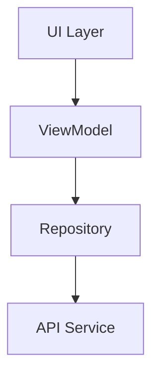

# NIT3213 Android Application


A modern Android application demonstrating API integration and clean architecture principles.

## 📱 Application Screens

| Login Screen | Dashboard Screen | Details Screen |
|--------------|------------------|----------------|
| Authenticates users | Displays entity list | Shows full details |

## 🔌 API Integration

### Base URL
`https://nit3213api.onrender.com/`

### Endpoints
| Endpoint | Method | Description |
|----------|--------|-------------|
| `/{location}/auth` | POST | User authentication |
| `/dashboard/{keypass}` | GET | Retrieve entity data |

**Sample Request:**
```json
{
  "username": "YourFirstName",
  "password": "sYourStudentID"
}
```

## 🛠 Technical Implementation

### Core Components
- **Dependency Injection**: Hilt
- **Networking**: Retrofit + Gson
- **UI**: Jetpack Components
- **Testing**: JUnit + Mockito

### Architecture


## 🚀 Getting Started

### Prerequisites
- Android Studio Flamingo+
- Android SDK 33+
- Java 17+

### Installation
1. Clone the repository:
   ```bash
   git clone https://github.com/your-repo/NIT3213-App.git
   ```
2. Open in Android Studio
3. Sync Gradle dependencies
4. Build and run


## 📂 Project Structure
```
app/
├── src/
│   ├── main/
│   │   ├── java/com/example/
│   │   │   ├── di/          # Dependency Injection
│   │   │   ├── network/     # API clients
│   │   │   ├── ui/          # Activities/Fragments
│   │   │   └── viewmodel/   # ViewModels
│   │   └── res/             # Resources
│   └── test/                # Unit tests
```

## ✍️ Author
Nupjan Koirala 
📧 Nupjan.5Koirala@gmail.com 

## 📜 License
This project is developed for educational purposes under NIT3213 course requirements.


